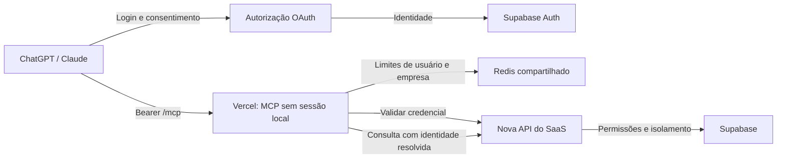

# MakeCRM Remote MCP

Núcleo de um servidor MCP remoto criado do zero em TypeScript, com meta inicial de **100 chamadas por segundo**. Oferece consultas de contatos, oportunidades e conversas, além do [primeiro grupo de oito ferramentas migradas](docs/tools-first-batch.md): cadastros, oportunidades com filtros, totais e contexto de contatos.

**Hospedagem: VPS com Portainer/Docker Swarm e Traefik**, usando `mcp.allyson.com.br` e o Redis existente. Use [portainer-stack.yml](portainer-stack.yml), o [Dockerfile](Dockerfile) e o [passo a passo de implantação](docs/portainer-setup.md). A entrada do container é `dist/main.js`; a configuração Vercel permanece como alternativa.

## Estado atual

Implementados: transporte Streamable HTTP sem sessão MCP local; nova API de leitura sobre o schema informado; consultas com o JWT do usuário e RLS preservada; emissão, listagem e revogação de UUIDs individuais; sessões criptografadas no Redis; paginação assinada; limites compartilhados e descoberta do servidor OAuth.

**OAuth implementado no backend; ativação e homologação no ambiente real pendentes.** Inclui PKCE S256, DCR com callbacks permitidos, consentimento individual, renovação de sessão dedicada, rotação de refresh tokens e revogação entre réplicas. Configure Supabase, integre os componentes no SaaS e publique a imagem conforme [OAuth em produção](docs/oauth-production.md). Não foi feito deploy remoto nem teste com contas reais nesta etapa.

Para testar consultas autenticadas no deploy, use **`AUTH_MODE=personal_token`**, sem `OAUTH_ISSUER`, com um cliente MCP que envie Bearer manual. Esse modo mantém Redis, RLS, permissões e revogação; não implementa a conexão OAuth nos apps de IA. Consulte o [roteiro de configuração e teste](docs/vercel-setup.md).

Não foram reaproveitadas ferramentas, APIs nem configurações secretas do projeto ao lado. Nenhum deploy ou alteração no Supabase real foi realizado. A migração foi aplicada e testada apenas em PostgreSQL temporário com dados fictícios.

## Decisões confirmadas

- SaaS em React, Vite e TypeScript; login por Supabase Auth.
- Um usuário pertence a uma única empresa; token individual.
- Acesso aos dados por uma API nova, com operações exclusivamente de leitura.
- Conexão com tela de login/autorização; hospedagem na Vercel.
- Meta de pico: 100 chamadas por segundo. O tamanho dos dados e a distribuição entre empresas ainda precisam ser medidos.

## Fluxo planejado



O UUID é uma credencial secreta emitida pelo backend, vinculada ao usuário e à sua empresa. O banco recebe a sessão Supabase do usuário, nunca o UUID do MCP. Essa sessão é armazenada com AES-256-GCM no Redis; o UUID completo é retornado uma única vez e não é persistido. A revogação remove a associação em todas as instâncias. O modo OAuth mantém uma sessão Supabase dedicada por conexão e entrega ao cliente somente credenciais MCP.

O MCP resolve `user_id` e `company_id` pela sessão autenticada. Esses campos não são argumentos das ferramentas. As funções SQL usam `SECURITY INVOKER` e `auth.uid()`, preservando as RLS do usuário, inclusive restrições dentro de uma empresa. Filtros explícitos de empresa complementam as RLS. Nenhuma política existente é alterada e a API não usa `service_role`.

## Executar verificações

```sh
npm ci
npm run check
npm run build
npm test
```

Os testes HTTP usam portas locais temporárias e dados fictícios. Para incluir os testes de atomicidade e sessões em Redis real, configure `TEST_REDIS_URL` apontando para uma instância de teste antes de executar `npm test`. Sem a variável, esses dois testes são explicitamente ignorados. As verificações SQL estão em `test/sql/` e são exclusivas de um banco temporário. Foram verificados 21 testes TypeScript e as asserções PostgreSQL com RLS.

## Executar o servidor

Aplique `supabase/migrations/202609080001_mcp_read_api.sql` primeiro em homologação. Preencha uma cópia de `.env.example` em `.env` e execute `npm run dev` ou `npm run build` seguido de `npm start`. Use a URL do Supabase, a chave **publishable/anon**, Redis e segredos próprios do backend. A configuração rejeita os valores ilustrativos; as consultas nunca usam uma chave administrativa do Supabase. Para OAuth, siga `docs/oauth-production.md`; o issuer é a origem do próprio MCP e o Supabase é o provedor usado pelo backend.

| Rota | Comportamento |
|---|---|
| `GET /` | Identificação do serviço e indicação do endpoint MCP; não atesta prontidão |
| `POST /mcp` | Protocolo MCP; Bearer obrigatório |
| `OPTIONS /mcp` | Preflight CORS com allowlist |
| `GET /mcp`, `DELETE /mcp` | 405 no modo sem sessão |
| `/.well-known/oauth-protected-resource/mcp` | Descoberta no modo `oauth`; 404 no modo `personal_token` |
| `/.well-known/oauth-protected-resource` | Alias da mesma descoberta |
| `/.well-known/oauth-authorization-server` | Descoberta do emissor MCP no modo OAuth |
| `/oauth/authorize`, `/oauth/token`, `/oauth/register`, `/oauth/revoke` | Autorização, tokens, cadastro e revogação OAuth |
| `/oauth/supabase/callback`, `/oauth/consent` | Callback do provedor e consentimento do cliente de IA |
| `/api/mcp-connections` | Gestão individual de conexões no modo OAuth |
| `/healthz` | Processo disponível |
| `/readyz` | Conectividade com Redis; não valida a integração com o SaaS |
| `/api/mcp-tokens` | POST emite e GET lista credenciais; sessão Supabase obrigatória |
| `DELETE /api/mcp-tokens/:id` | Revoga somente credencial pertencente ao usuário autenticado |
| `/internal/mcp/introspect` | Valida UUID; credencial de serviço interna obrigatória |
| `/internal/mcp/read/:collection` | API interna de leitura com RLS, para execução separada do MCP |

Buscas existentes: `search_contacts`, `search_opportunities`, `search_conversations`. Todas usam `query`, `cursor` e `limit` (1–100, padrão 25), e retornam `items` e `next_cursor`. A busca atual consulta nomes e, nas conversas, também o identificador. `search_conversations` retorna metadados; histórico de mensagens e mensagens privadas não são incluídos nessa ferramenta.

Com integração direta ao Supabase, o catálogo contém 11 ferramentas. Veja [ferramentas migradas, permissões e publicação](docs/tools-first-batch.md). Os novos escopos `catalog:read` e `contacts:context:read` exigem autorização; conexões existentes não os recebem automaticamente. O grupo usa APIs/RPCs existentes, sem migração SQL.

## Vercel

Use a raiz (`.`) como Root Directory do repositório `makeaceleradordevendas/makecrm-mcp`. A entrada é `src/index.ts`, com exportação de Express e Fluid compute habilitado em `vercel.json`. A Vercel suporta esse modelo de aplicação como uma função com concorrência por instância. [Documentação da Vercel](https://vercel.com/kb/guide/ship-a-express-app-on-vercel).

Configure as variáveis do exemplo no ambiente apropriado. Use HTTPS público estável, um Redis gerenciado com TLS (`rediss://`) e credencial de serviço exclusiva para a nova API. Posicione Vercel, Redis e Supabase em regiões próximas; a região depende de onde o Supabase atual está hospedado.

O arquivo `.env.example` **não configura o deploy automaticamente**. Veja o [passo a passo e diagnóstico de inicialização](docs/vercel-setup.md). Na entrada Vercel, uma falha de inicialização retorna HTTP 503 em todas as rotas e registra `startup_failed`; falhas de validação registram somente os nomes dos campos inválidos, sem seus valores. Não há acesso ao MCP enquanto a inicialização falhar.

`ALLOWED_HOSTS` deve conter os domínios efetivos, incluindo previews que forem usados. `ALLOWED_ORIGINS` é uma lista exata das origens de navegador autorizadas; clientes servidor-a-servidor podem não enviar Origin. CORS não autentica ninguém.

Na Vercel, configure `TRUST_PROXY_HOPS=1` após confirmar o caminho de rede. A plataforma documenta que sobrescreve `x-forwarded-for` para evitar falsificação. Fora dela, só confie em proxies cujo acesso direto esteja bloqueado. [Cabeçalhos da Vercel](https://vercel.com/docs/headers/request-headers).

Os limites por IP são uma proteção secundária: ChatGPT/Claude podem compartilhar IPs de saída entre muitos usuários. Use os controles do proxy/firewall para abuso antes de chegar à aplicação. Os limites por usuário e empresa são compartilhados em Redis, independentemente da instância.

## Próximas integrações

Veja [integração da nova API e autorização](docs/integration.md), [mapeamento do schema](docs/schema-mapping.md) e [plano para 100 chamadas por segundo](docs/capacity.md). O schema já foi integrado; as RLS atuais serão a autoridade de visibilidade. Falta configurar e homologar no ambiente real; a renovação OAuth independente da sessão do navegador está implementada.
